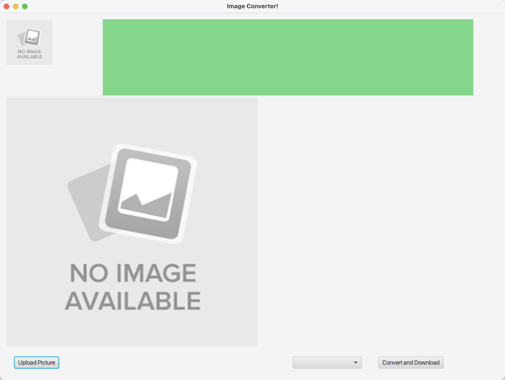
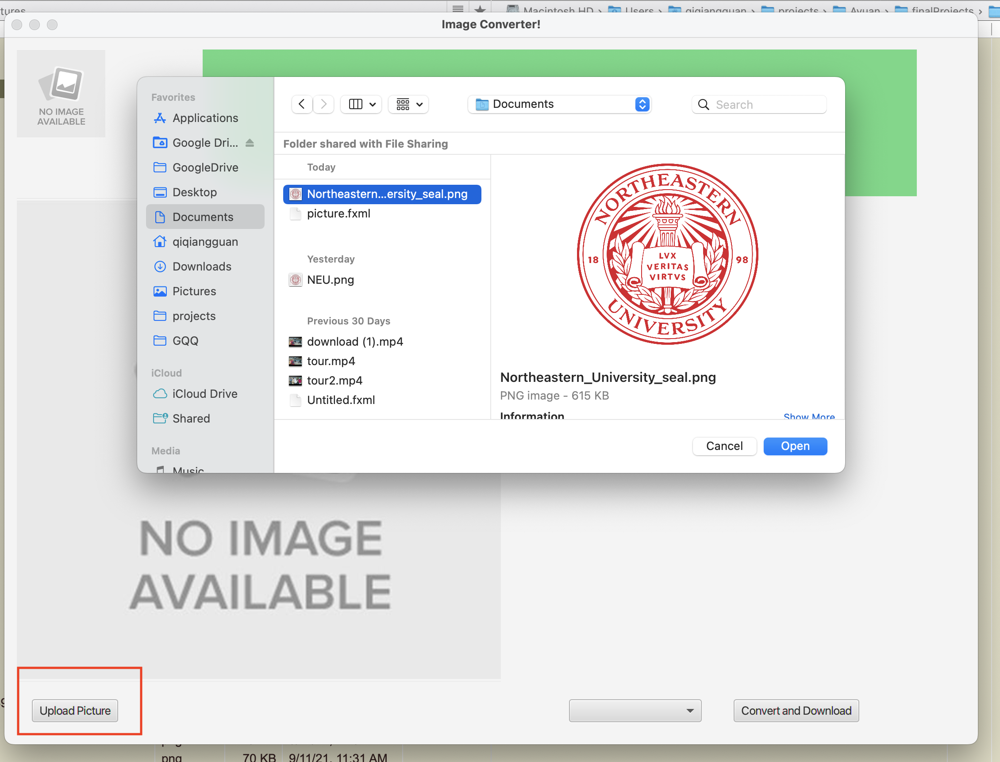
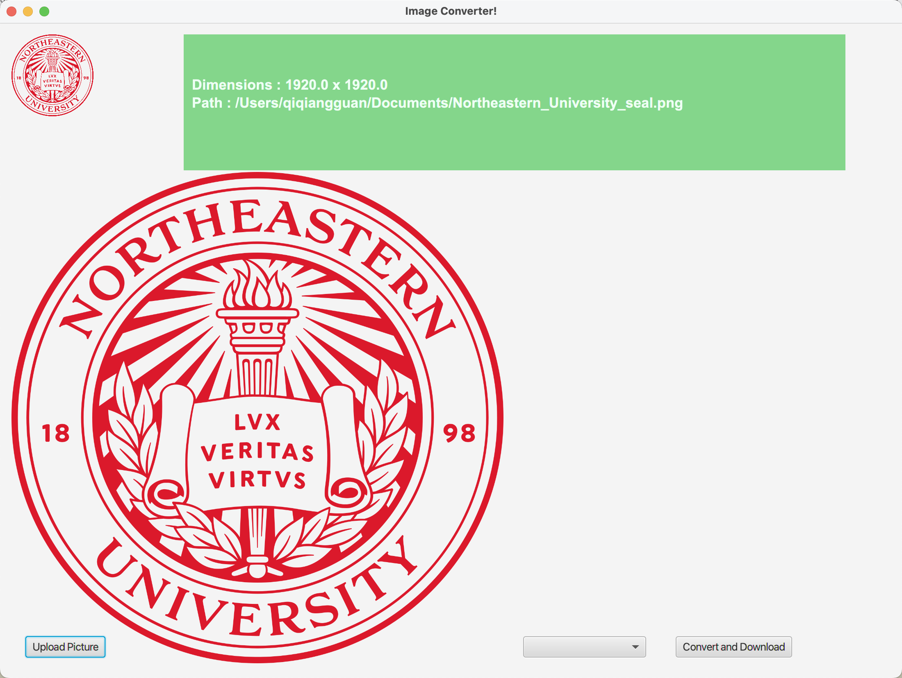
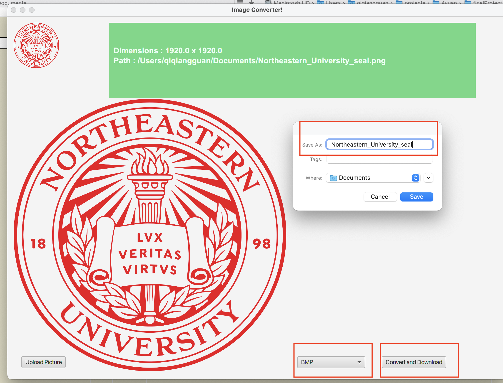
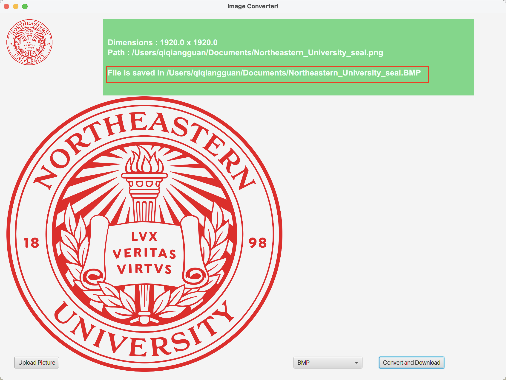
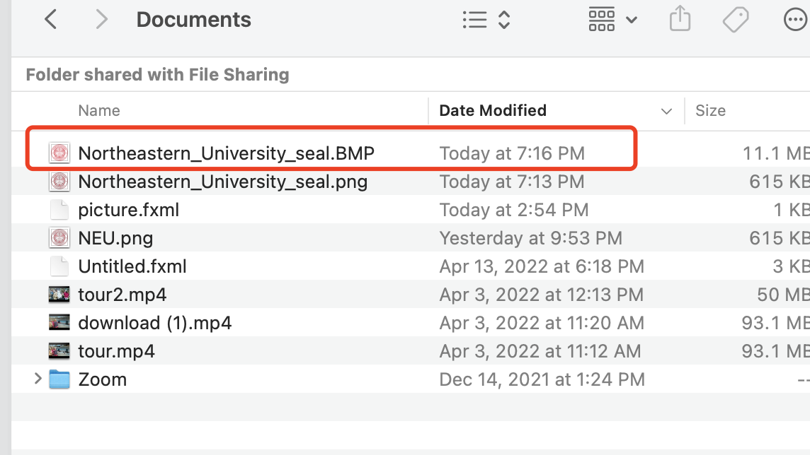
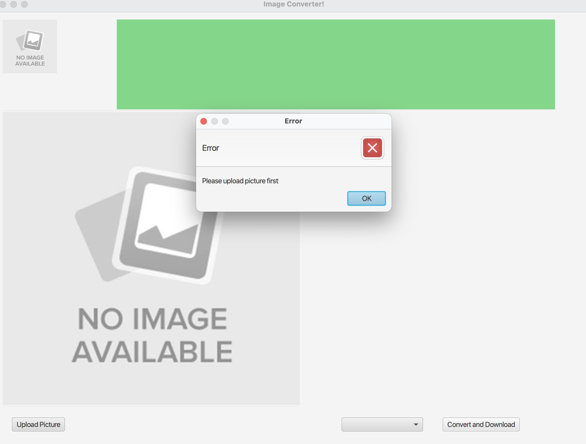
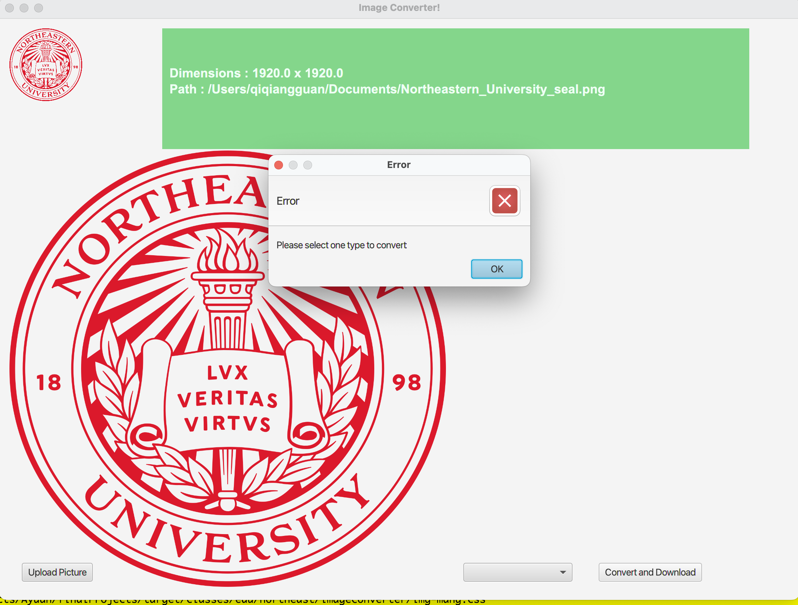
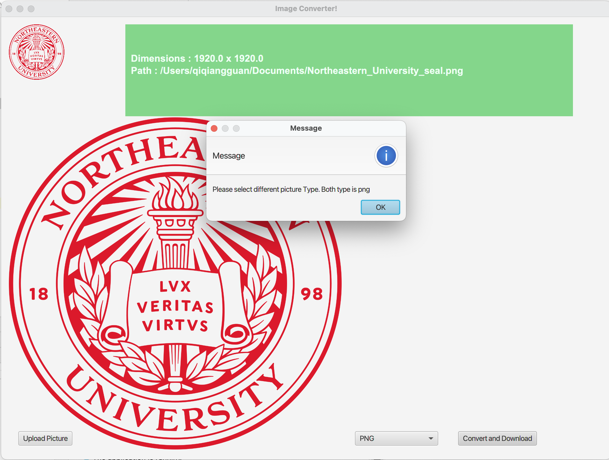

# Picture Management

Picture Management is using JavaFX for GUI, and provided the following functions:
1. Allow user to upload image file from desktop/laptop.
2. When uploaded, show image and thumbnail(100x100) to users on the GUI.
3. We are showing image properties (height, width, location) on the GUI.
4. Users can select the formats which they are going to convert to and save into local place.

## Table of Contents
**[Steps of Converting Images](#steps-of-converting-images)** 
**[Various Errors Testing](#various-errors-testing)** 

## Steps of Converting Images
1. Running `ImgManagementApplication.java`, the APP shows.

   

2. Select `Upload Picture` button, the upload dialog window will show.

   

3. Select one picture, click `Open` button. The GUI will display image and thumbnail.
   
   Image properties __`Dimensions`__ and __`Path`__ is showing in the green `Green Message Label`.

   

4. Select format needed to be converted into from the choice box, then click `Convert and Download` button. The save dialog window shows.

   

5. After saving, the saving information displays in the `Green Message Label`.

   

6. We can find the converted file in the location of laptop/PC.

   

## Various Errors Testing

- Picture Not Updated Error
   
   

- Format Not Selected Error

   

- Same Extensions Error.

   If the original format is the same as converted format, we will show error message as following:

   
